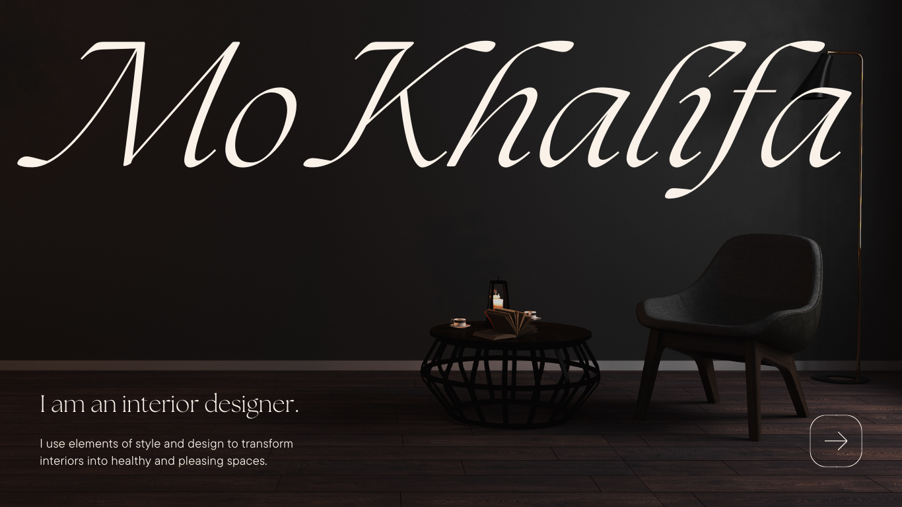

# Mo Khalifa | Interior Design Portfolio

**Live Preview:** [https://mokhalifa83.github.io/design-portfolio-minimalist/](https://mokhalifa83.github.io/design-portfolio-minimalist/)

A premium, high-fidelity interior design portfolio featuring contemporary aesthetics, sticky parallax stacking effects, and smooth animations. This project is a showcase of professional UI/UX design, advanced CSS interactions, and modern frontend development.



## ✨ Key Features
- **Modern Minimalist Aesthetic**: A carefully curated "Classic Minimal" dark theme with sophisticated ivory typography.
- **Sticky Parallax Stacking**: An advanced scrolling interaction where sections stack on top of each other as the user scrolls.
- **Fluid & Responsive Design**: Seamlessly adapts across diverse screen sizes, maintaining the high-end look and feel.
- **Stunning Animations**: Powered by [Framer Motion](https://www.framer.com/motion/) for elegant entrance transitions and interactive elements.
- **Custom Typography**: Integrated premium OTF fonts (The Seasons) and high-contrast Google Fonts (Playfair Display).

## 🛠️ Tech Stack
- **Framework**: [React 19](https://react.dev/)
- **Styling**: Vanilla CSS (Modern Flexbox/Grid)
- **Animations**: Framer Motion
- **Build Tool**: [Vite](https://vitejs.dev/)
- **Linting**: ESLint

## 🚀 Getting Started

### Prerequisites
- Node.js (Latest LTS version recommended)
- npm or yarn

### Installation
1. Clone the repository:
   ```bash
   git clone https://github.com/YOUR_USERNAME/mo-khalifa-portfolio.git
   ```
2. Navigate to the project directory:
   ```bash
   cd interior-portfolio
   ```
3. Install dependencies:
   ```bash
   npm install
   ```
4. Start the development server:
   ```bash
   npm run dev
   ```

## 📂 Project Structure
- `/src/assets`: High-quality project images and premium typography files.
- `/src/Home.jsx`: Hero section with animated introduction.
- `/src/About.jsx`: Detailed professional background with grid-based layout.
- `/src/Projects.jsx`: Portfolio showcase with staggered entrance animations.
- `/src/Contact.jsx`: Clean minimal contact page with portrait integration.

---

Designed and developed by **[Mo Khalifa](https://mokhalifa.site)**.
